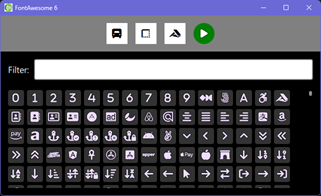

# FontAwesome for QML

This is a part of [Node3D](https://github.com/node-3d) project.

[](https://badge.fury.io/js/qml-fontawesome-raub)

```console
npm i -s qml-fontawesome-raub
```



Provides **FontAwesome 6+** icons and helpers for QML. It is possible but not obligatory
to use this repo as NPM module.


## Features

* FontAwesome **6.7.2**
* Uses local OTF files (sync load)
* Parses native `icons.json` (that comes with fonts)
* Seamless handling of 3 separate fonts
* Classic icon names - `fa_xxxxx_o`
* Icons alias names supported

### Notes

Original `icons.json` is altered to become the `FontAwesome/webfonts/icons.js`
(by only prefixing `const icons = `), because
for QML it is easier to work with JS. Then the file is parsed on runtime to build the
icon sets. Hence it should be straightforward to upgrade the fonts in future.

The icon names are taken from `icons.json` and prefixed with "fa_", the dashes are
replaced with lo-dashes. E.g. `plug-circle-bolt` -> `fa_plug_circle_bolt`.

If the same icon exists in solid and regular styles, the regular one receives the
`_o` suffix, so that there are 2 distinct icon names. E.g. `fa_sun` and `fa_sun_o`.


## Available QML types

Importing the module automatically instantiates the `FontAwesome` singleton that loads
fonts and provides low-level interface:

```ts
FontAwesome.icons: { [name]: string } // icon name -> unicode character
FontAwesome.list: string[] // list of all icon names, same as `Object.keys(FontAwesome.icons)`
FontAwesome.listUnique: string[] // list of unique icon names, excluding aliases
FontAwesome.getFamily: (name) => string // one of Font Awesome font names
FontAwesome.getWeight: (name) => number // 400 or 900 (`Font.Normal` or `Font.Black`)
FontAwesome.getText: (name) => string // icon unicode, sane as `FontAwesome.icons[name]`
```

Type `IconAwesome` wraps the above to display any icon, but it is not obligatory to use.
Note that if you use raw `Text { ... }` instead, you should NOT alternate between 2 icons that
are in different `font.family`. Doing that may cause errors(/crashes) and freezes on Qt
font engine side.
E.g. `Text { font.family: FontAwesome.getFamily(test ? "fa_youtube" : "fa_sun") }` - will
cause issues because one icon is in "brands" and the other is in "solid".

```qml
IconAwesome {
	// var, "fa_<ICON_NAME>"/"fa_<ICON_NAME>_o", supports `"", undefined, null`
	name: ""
	// int, approximate pixel size of icon in pixels (not exactly the font size)
	size: 18
	// color, as in `Text { color }`
	color: "white"
	// color, as in `Text { styleColor }`
	styleColor: "#88000000"
	// int, as in `Text { style }`
	style: Text.Outline
}
```


Type `IconAwesomeHelper` is a full-size page displaying every available icon (including
aliases). It also has a filter to only display the matching icons.

```qml
IconAwesomeHelper {}
```


## Importing

The `./FontAwesome` directory should be visible to QML engine for importing.

```qml
import FontAwesome
```

### C++ import path

```cpp
qmlEngine->addImportPath("path to qml-fontawesome-raub");
```

### Node.js qml-raub

```js
View.libs(require('qml-fontawesome-raub').absPath);
```

### Manual

Copy this repo or even specifically the `./FontAwesome` folder to wherever your QML is
ready to grab it. Or use this repo as a submodule if you wish.


## Legal notice

This software uses the [FontAwesome 6 Free](https://fontawesome.com/).

FontAwesome licensing information (a COPY) is given in a [separate file](/FontAwesome/webfonts/LICENSE.txt),
which also can be found in
[FontAwesome official repo](https://github.com/FortAwesome/Font-Awesome/blob/6.x/LICENSE.txt).

---

The rest of this package is MIT licensed.
